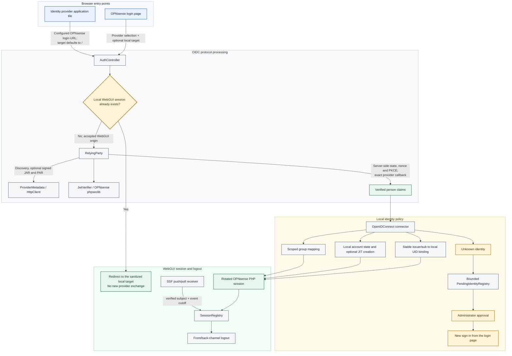
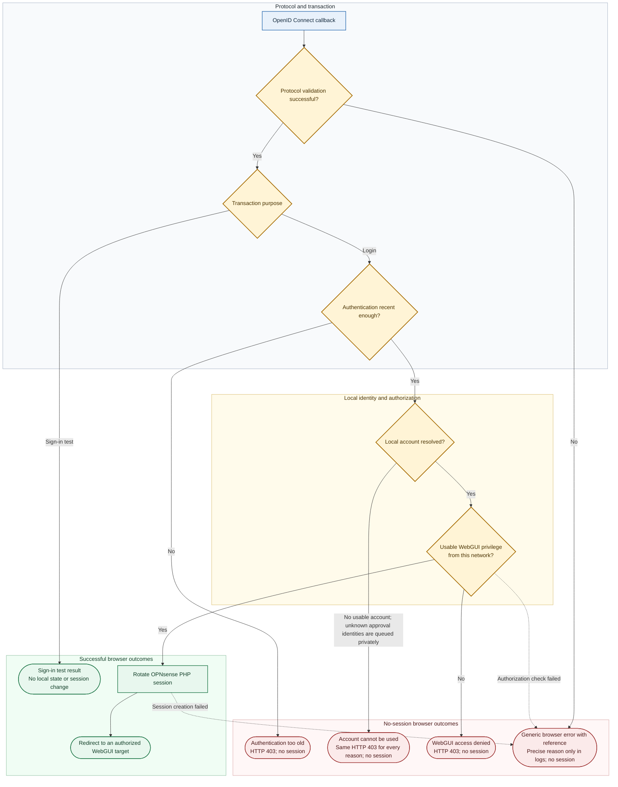

# Architecture

## Data flow

An "IdP-initiated" application launch is only an alternative browser entry
point. The provider tile links to the OPNsense login endpoint; it does not send
an unsolicited authorization response to the callback. Unless a local WebGUI
session already exists, an enabled provider under an accepted WebGUI origin
starts the same state-, nonce- and PKCE-bound Authorization Code flow used by
the login-page button.

## Browser outcomes

Successful provider authentication does not by itself grant WebGUI access or
create a local session. After the callback, the transaction purpose, local
identity policy and effective OPNsense WebGUI ACL determine the browser-visible
result.

## Components

| Component | Responsibility | Must not do |
|---|---|---|
| `AuthController` | public protocol endpoints including the exact-origin pairwise-sector document, package-owned and safely proxied login icons, generic browser errors, audit records, session elevation/logout | decide JWT validity or account policy |
| `RelyingParty` | authorization transaction, optional signed JAR and PAR, code exchange, claim-source composition, logout/revocation requests | perform cryptography or grant privileges |
| `RequestObjectSigner` | bounded RFC 9101 claims, provider/key algorithm selection and phpseclib signature | choose authorization policy, expose a private key or encrypt Request Objects |
| `ProviderMetadata` | exact Discovery validation and immutable per-login metadata snapshot | guess provider endpoints |
| `DiscoveryController` / `HealthController` / `ProviderProbe` | authenticated, CSRF-protected diagnostics from current form values with explicit actor paths and verification methods | persist form values, return secrets or pretend an advertised browser/token path was exercised |
| `TestController` | authenticated and CSRF-protected initiation of a saved provider's non-mutating browser test | accept an unsaved secret, grant a session or change local identity state |
| `ApprovalController` | authenticated CRUD for durable bindings, explicit local-account creation and approval/denial of identities queued for one saved server; rechecks the core authentication-server, user-manager and read-only privileges | authenticate the identity, create a session, trust button visibility as authorization or choose a local account automatically |
| `SetupController` / `ProviderSetup` | authenticated, no-secret provider import generation from an unfinished form | contact the provider, persist credentials or mutate either system |
| `HttpClient` | the only provider network transport; HTTPS, TLS, limits and redirect policy | follow credentials through redirects |
| `JwtVerifier` | JWS and OIDC/logout claim validation using OPNsense phpseclib | accept token-selected keys or symmetric ID Token signatures |
| `AuthenticationRequirement` | freeze one requested MFA/phishing-resistant policy and validate its verified `acr`/`acrs` plus `amr` evidence | infer provider semantics or inspect an unverified token |
| `OpenIDConnect` | settings, stable identity binding, local account and group policy | establish browser sessions |
| `WebGuiAccess` | apply OPNsense's effective user/group/source-network ACL and choose a navigable landing page | grant privileges or treat logout/API routes as human access |
| `SessionRegistry` | minimal session lookup and logout replay protection | store ID/access/refresh tokens or client secrets |
| `SsfController` / `SecurityEventVerifier` | authenticate RFC 8935 delivery, validate SSF metadata and signed SETs, end matching pre-event sessions | change accounts, bindings, groups or privileges |
| `SharedSignalsClient` / `SharedSignalsPoller` | bind stream lifecycle and explicit RFC 8936 short polling to discovered endpoints, authorization metadata and validated stream configuration | invent endpoints, fall back from push, retain SETs or expose management credentials |
| `TransactionRegistry` | one-time `form_post` transactions when SameSite=Lax suppresses the original session cookie | store grants, secrets or long-lived state |
| `PendingIdentityRegistry` | bounded seven-day holding area for exact unknown identities and short display hints | grant access or let unauthenticated requests write `config.xml` |
| `OpenIDConnectContainer` | safe login-page button descriptors, fixed public labels and reuse of core's localized login sentence | inject administrator-authored raw HTML or confuse the server lookup name with its visible label |
| watchdog | detect login-page or OPNsense integration drift | claim protocol conformance |
| E2E Playwright / passive OWASP ZAP | produce every stateful browser response class and independently parse its security headers | spider one-time callbacks, actively attack a target or replace endpoint-specific assertions with a generic grade |

## Response hardening ownership

| Owner | Responsibility |
|---|---|
| OpenID Connect plugin controllers | endpoint-specific cache, referrer, MIME and CSP headers; self-contained external outcome pages; documented front-channel iframe and cacheable-icon exceptions |
| OPNsense core | response policy for pages rendered through the normal login/WebGUI path, API authentication and CSRF dispatch, and native PHP session-cookie attributes; its GUI CSP does not cover direct plugin-controller documents |
| WebGUI TLS listener or reverse proxy | HTTPS and host-wide HSTS; with TLS offload, the proxy must also preserve the public HTTPS origin and harden response cookies |

The exact endpoint matrix and the reasons for the two exceptions are recorded in
[Browser response security](security-and-conformance.md#browser-response-security).

## Trust boundaries

- The browser is untrusted. Only local destinations survive redirect handling;
  callback parameters must match a server-side, single-use transaction.
- The normal WebGUI transport boundary is native HTTPS. An explicit TLS-offload
  exception accepts an internal HTTP request only when its exact `Host` maps to
  a saved custom public HTTPS origin. Forwarded scheme headers and PROXY
  protocol are not security authorities; optional PROXY framing belongs to the
  lighttpd listener and may supply client-address context only.
- The identity provider is trusted to authenticate users and assert configured
  identity/authorization claims, but not to choose its own verification key,
  redirect target, issuer, client audience or local account.
- An enabled Shared Signals transmitter is separately trusted to report the
  configured CAEP/RISC events for its exact issuer and audience. Its bearer
  delivery secret is checked before outbound discovery or signature work.
  Stream-management and poll authorization is sent only to validated discovered
  management endpoints or the exact HTTPS poll endpoint returned by the bound
  stream; credential-bearing redirects are refused.
- A configured provider is an administrator-approved network peer. Private
  provider addresses are intentionally supported for self-hosted IdPs; therefore
  provider URL configuration is privileged and effectively grants bounded
  outbound HTTPS access from the firewall.
- OPNsense configuration and PHP session storage are trusted local state. File
  indexes are mode `0600`; the logout indexes contain identifiers only, while
  the short-lived form-post index contains state, nonce, PKCE verifier and the
  validated metadata snapshot, but no token or client secret.
- phpseclib is an OPNsense runtime component. The plugin owns algorithm policy
  and claim validation; it does not implement RSA or elliptic-curve arithmetic.

## State and persistence

- Query and signed-query pending logins live only in the initiating PHP session, keyed by
  random state. At most five are retained for ten minutes. OPNsense sets its
  session cookie to `SameSite=Lax`, so Form POST and signed Form POST transactions instead use a
  bounded mode-`0600` server-side index. They remain random-state-bound,
  single-use and expire after ten minutes without weakening the session cookie.
- A sign-in test uses the same transaction, Discovery, PKCE, token and claim
  validation path, marked server-side as test-only. Its callback reports the
  verified identity but does not resolve or mutate a local account and does not
  elevate or replace the initiating WebGUI session.
- Validated Discovery and JWKS responses are shared through bounded, HTTP-aware
  mode-`0600` caches and refreshed outside the login path. The exact metadata
  snapshot used at login is still frozen into the transaction so endpoints
  cannot change halfway through it. Automatic PAR may bypass only a temporarily
  unavailable optional endpoint; the provider requirement and every TLS,
  authentication or protocol failure remain fail-closed.
- A selected dedicated OPNsense certificate signs all authorization parameters
  into a 60-second RFC 9101 Request Object with exact issuer/audience binding
  and a fresh `jti`. Its certificate reference is the registered `kid`; PAR
  transports the signed object unchanged. Provider-required JAR, missing keys
  and algorithm mismatches fail before browser state is stored.
- Identity bindings live in the normal `<system><authserver>` OPNsense
  configuration and bind an issuer/subject pair to a numeric local UID. Their
  opaque storage field is administered only through the combined identity
  manager so ordinary form saves cannot race with or overwrite a manager edit.
- Pending approval requests live in a mode-`0600` local index, contain no token
  or secret, are capped at 100 and expire after seven days. Only approval moves
  the exact issuer/subject pair into OPNsense configuration.
- A selected JARM mode is frozen into the transaction. Its response JWT is
  accepted only with the frozen issuer and key-set URL, a supported advertised
  asymmetric algorithm, this client's audience, valid time and the exact
  one-time state; the transport must match and direct parameters cannot
  downgrade it. Encrypted JARM is deliberately unsupported.
- ID, access and refresh tokens live only in the authenticated PHP session for
  optional provider logout/revocation. They are never logged or placed in the
  logout index.
- An optional authentication requirement is frozen into the same one-time login
  transaction as issuer, nonce, PKCE and metadata. The callback refuses a
  configuration mismatch and validates only the signed ID Token before local
  account or session processing.
- The logout index contains PHP session ID, issuer, subject, provider `sid` and
  creation time and expiry. The logout replay index contains only a hash of
  issuer plus logout `jti`; the SSF replay index likewise stores only a bounded
  digest and expiry. SSF poll health stores timestamps, status categories and
  counts only, never the authorization value, SET or subject.

## Failure model

Protocol and account failures fail closed. Public protocol errors contain a
random reference, while the precise reason goes to audit/system logs. A user
whose provider authentication and identity mapping succeed but whose local
account has no usable WebGUI ACL receives an explicit 403 explanation; no local
session is created. Logout always
destroys the local session before attempting best-effort remote revocation or
provider redirect, so a provider outage cannot strand a locally valid session.
Shared Signals failures never change local identity state. Invalid deliveries
receive the RFC 8935 error class without revealing whether a subject or session
exists; a valid event with no matching session is still accepted. Polling is
activated only by its saved delivery choice and complete managed-stream values;
push failure cannot activate it. Valid polled SETs are acknowledged after local
processing, invalid SETs receive bounded RFC 8936 error acknowledgements, and a
failed local action remains available for retry.
