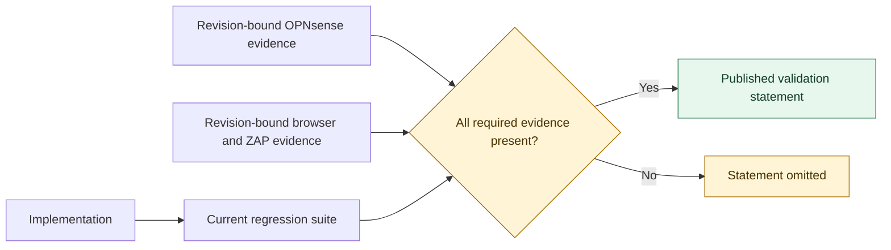

<!-- Generated by tests/update-audit-report.py; do not edit this file manually. -->
# OpenID Connect security validation

This document records security and protocol properties that are both implemented
and backed by the evidence required in `tests/audit-controls.json`. A property is
omitted unless every required validation tier succeeds. The report is therefore a
positive validation statement, not a backlog, CI status page, certification or
independent penetration test.

## Evidence model

The host-independent suite is executed for every regeneration. External evidence
is accepted only when it reports a complete passing execution from a clean source
revision and none of the control's implementation or validation files changed
after that revision.

Evidence contributing to this report:

- current host-independent regression suite

## OIDC and OAuth protocol validation

| Validated security property | Implementation | Validation evidence |
|---|---|---|
| Discovery accepts only a well-formed HTTPS document whose issuer exactly matches the configured authority and whose advertised endpoints and capabilities satisfy the supported profile. | [src/opnsense/mvc/app/library/OPNsense/OpenIDConnect/ProviderMetadata.php](../../src/opnsense/mvc/app/library/OPNsense/OpenIDConnect/ProviderMetadata.php) [src/opnsense/mvc/app/library/OPNsense/OpenIDConnect/HttpClient.php](../../src/opnsense/mvc/app/library/OPNsense/OpenIDConnect/HttpClient.php) | current host-independent regression suite: [tests/unit/exchange.php](../../tests/unit/exchange.php), [tests/unit/settings.php](../../tests/unit/settings.php) |
| Only validated public Discovery and JWKS responses enter bounded HTTP-aware caches; automatic PAR bypass is limited to temporary availability failures while provider-required PAR and every TLS, authentication or protocol error fail closed. | [src/opnsense/mvc/app/library/OPNsense/OpenIDConnect/ProviderCache.php](../../src/opnsense/mvc/app/library/OPNsense/OpenIDConnect/ProviderCache.php) [src/opnsense/mvc/app/library/OPNsense/OpenIDConnect/RelyingParty.php](../../src/opnsense/mvc/app/library/OPNsense/OpenIDConnect/RelyingParty.php) [src/opnsense/mvc/app/library/OPNsense/OpenIDConnect/ParClient.php](../../src/opnsense/mvc/app/library/OPNsense/OpenIDConnect/ParClient.php) | current host-independent regression suite: [tests/unit/exchange.php](../../tests/unit/exchange.php), [tests/unit/settings.php](../../tests/unit/settings.php) |
| Every login uses the Authorization Code flow with random server-side state, nonce and PKCE S256, and binds the response to the intended provider callback. | [src/opnsense/mvc/app/library/OPNsense/OpenIDConnect/RelyingParty.php](../../src/opnsense/mvc/app/library/OPNsense/OpenIDConnect/RelyingParty.php) [src/opnsense/mvc/app/library/OPNsense/OpenIDConnect/TransactionRegistry.php](../../src/opnsense/mvc/app/library/OPNsense/OpenIDConnect/TransactionRegistry.php) | current host-independent regression suite: [tests/unit/exchange.php](../../tests/unit/exchange.php), [tests/unit/redirects.php](../../tests/unit/redirects.php) |
| Frozen provider metadata, distinct callbacks, RFC 9207 issuer checking when advertised and one-time transaction consumption prevent mix-up and callback replay. | [src/opnsense/mvc/app/library/OPNsense/OpenIDConnect/RelyingParty.php](../../src/opnsense/mvc/app/library/OPNsense/OpenIDConnect/RelyingParty.php) [src/opnsense/mvc/app/library/OPNsense/OpenIDConnect/ProviderMetadata.php](../../src/opnsense/mvc/app/library/OPNsense/OpenIDConnect/ProviderMetadata.php) | current host-independent regression suite: [tests/unit/exchange.php](../../tests/unit/exchange.php) |
| Provider communication is HTTPS-only and bounded by media-type, body-size, timeout and redirect rules that refuse credential-bearing redirects. | [src/opnsense/mvc/app/library/OPNsense/OpenIDConnect/HttpClient.php](../../src/opnsense/mvc/app/library/OPNsense/OpenIDConnect/HttpClient.php) | current host-independent regression suite: [tests/unit/exchange.php](../../tests/unit/exchange.php) |
| UserInfo data is accepted only over the protected provider transport and only when its subject exactly matches the validated ID Token subject. | [src/opnsense/mvc/app/library/OPNsense/OpenIDConnect/RelyingParty.php](../../src/opnsense/mvc/app/library/OPNsense/OpenIDConnect/RelyingParty.php) | current host-independent regression suite: [tests/unit/claims.php](../../tests/unit/claims.php), [tests/unit/exchange.php](../../tests/unit/exchange.php) |

## Local identity and authorization

| Validated security property | Implementation | Validation evidence |
|---|---|---|
| A durable identity binds the exact issuer and subject to a numeric local UID, so mutable usernames and e-mail addresses cannot silently reassign it. | [src/opnsense/mvc/app/library/OPNsense/Auth/OpenIDConnect.php](../../src/opnsense/mvc/app/library/OPNsense/Auth/OpenIDConnect.php) | current host-independent regression suite: [tests/unit/accounts.php](../../tests/unit/accounts.php) |
| Unknown, disabled, expired and privileged local accounts fail closed; strict admission and explicit administrator approval remain the safe paths. | [src/opnsense/mvc/app/library/OPNsense/Auth/OpenIDConnect.php](../../src/opnsense/mvc/app/library/OPNsense/Auth/OpenIDConnect.php) [src/opnsense/mvc/app/library/OPNsense/OpenIDConnect/PendingIdentityRegistry.php](../../src/opnsense/mvc/app/library/OPNsense/OpenIDConnect/PendingIdentityRegistry.php) | current host-independent regression suite: [tests/unit/accounts.php](../../tests/unit/accounts.php) |
| Provider-controlled groups are disabled by default and can affect only explicitly assignable local groups unless full delegation is deliberately enabled. | [src/opnsense/mvc/app/library/OPNsense/Auth/OpenIDConnect.php](../../src/opnsense/mvc/app/library/OPNsense/Auth/OpenIDConnect.php) | current host-independent regression suite: [tests/unit/groups.php](../../tests/unit/groups.php) |

## Session and logout security

| Validated security property | Implementation | Validation evidence |
|---|---|---|
| Logout and revocation grants are sent only after Discovery resolves the exact issuer stored with the local session, so reusing an authentication-server name for another issuer cannot receive earlier grants. | [src/opnsense/mvc/app/controllers/OPNsense/OpenIDConnect/Api/AuthController.php](../../src/opnsense/mvc/app/controllers/OPNsense/OpenIDConnect/Api/AuthController.php) [src/opnsense/mvc/app/library/OPNsense/OpenIDConnect/RelyingParty.php](../../src/opnsense/mvc/app/library/OPNsense/OpenIDConnect/RelyingParty.php) | current host-independent regression suite: [tests/unit/exchange.php](../../tests/unit/exchange.php) |

## Browser response security

| Validated security property | Implementation | Validation evidence |
|---|---|---|
| Provider labels remain escaped plain text and package or proxied icons are restricted to reviewed, bounded and sandboxed image content. | [src/opnsense/mvc/app/library/OPNsense/Auth/SSOProviders/OpenIDConnectContainer.php](../../src/opnsense/mvc/app/library/OPNsense/Auth/SSOProviders/OpenIDConnectContainer.php) [src/opnsense/mvc/app/controllers/OPNsense/OpenIDConnect/Api/AuthController.php](../../src/opnsense/mvc/app/controllers/OPNsense/OpenIDConnect/Api/AuthController.php) | current host-independent regression suite: [tests/unit/loginpage.php](../../tests/unit/loginpage.php), [tests/package.py](../../tests/package.py) |

## Package and provider onboarding integrity

| Validated security property | Implementation | Validation evidence |
|---|---|---|
| The package is built with a complete manifest, exact checksums, root ownership, constrained permissions and no bundled third-party OIDC client. | [packaging/build.py](../../packaging/build.py) | current host-independent regression suite: [tests/package.py](../../tests/package.py) |
| The release workflow attests the exact package built by a GitHub tag push, inventories all draft assets, refuses replacement of a published release, verifies immutability after publication and documents provenance verification before installation; the package also installs a nightly core-drift watchdog. | [.github/workflows/build.yml](../../.github/workflows/build.yml) [packaging/release-notes.py](../../packaging/release-notes.py) [packaging/watch/openid-connect-watch](../../packaging/watch/openid-connect-watch) [packaging/build.py](../../packaging/build.py) | current host-independent regression suite: [tests/convention.py](../../tests/convention.py), [tests/package.py](../../tests/package.py) |
| Named provider presets cover every provider-dependent field, and generated Keycloak or authentik setup files contain exact redirects without embedding a client secret. | [src/opnsense/mvc/app/library/OPNsense/Auth/OpenIDConnect.php](../../src/opnsense/mvc/app/library/OPNsense/Auth/OpenIDConnect.php) [src/opnsense/mvc/app/library/OPNsense/OpenIDConnect/ProviderSetup.php](../../src/opnsense/mvc/app/library/OPNsense/OpenIDConnect/ProviderSetup.php) | current host-independent regression suite: [tests/unit/settings.php](../../tests/unit/settings.php), [tests/unit/provider-setup.php](../../tests/unit/provider-setup.php) |

## Interpretation boundary

The absence of a statement is not represented as a finding. It means only that
the complete evidence required for that statement was not supplied to this
generation. Unsupported optional protocol features and accepted operational risks
remain documented in [security.md](security.md); trust boundaries and component
ownership remain documented in [architecture.md](architecture.md).

## Reproduction

    python3 tests/update-audit-report.py --check
    python3 tests/update-audit-report.py --update

Retained sanitized evidence may be placed under `tests/evidence/*.json` or supplied
with repeated `--evidence /absolute/path.json` options. CI uses `--check`, so a
changed implementation, validation rule or evidence set cannot leave this report
silently stale.
