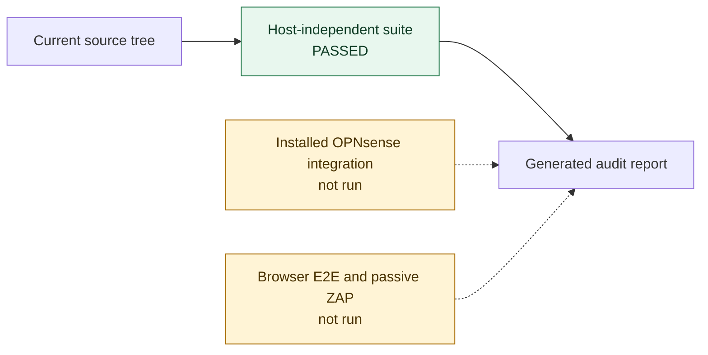

<!-- Generated by tests/update-audit-report.py; do not edit this file manually. -->
# Automated implementation audit

This report is regenerated from the current working tree by
`python3 tests/update-audit-report.py --update`. Its assertions are limited
to evidence produced by the repository test tiers; it is not OpenID
certification, an independent code audit or a penetration test.

## Result

Overall host-independent result: **PASSED**.

## Test-stage evidence

| Stage | Result | Evidence |
|---|---:|---|
| Syntax | **passed** | all files parse |
| Behaviour | **passed** | 405 checks passed |
| Commit/release convention | **passed** | 57 checks passed |
| Package/archive/supply chain | **passed** | 337 checks passed |

## Current findings

No host-independent check currently fails.

## Security and implementation control matrix

| Result | Meaning |
|---|---|
| passed | every mapped host-independent check passed |
| failed | at least one mapped check failed |
| partial | mapped host checks passed, but a named runtime boundary was not exercised |
| not run | fail-fast stopped before mapped evidence was produced |
| not exercised | the control belongs entirely to an explicit external test tier |

| ID | Severity | Control objective | Result | Evidence boundary |
|---|---:|---|---:|---|
| A-01 | high | Stable issuer/subject identity binding | **passed** | Stable issuer and subject bindings |
| A-02 | high | Local account admission and refusal policy | **passed** | An account that may not be used; Administrator approval admission policy |
| A-03 | high | Mix-up, callback-origin and local redirect protection | **passed** | Login transactions, PKCE and mix-up protection; Choosing the address the provider returns to; local WebGUI authorization |
| A-04 | high | JWT issuer, signature, audience and claim policy | **partial** | ID token claim validation; Whom a token was issued for; real phpseclib execution requires the installed integration tier |
| A-05 | high | Provider group claims cannot silently widen privilege | **partial** | Group membership is left alone unless asked for; What the provider offers; Default groups belong to the login that creates the account; real core group synchronization requires the installed integration tier |
| A-06 | high | Session elevation rotates and removes the old session ID | **not exercised** | requires the disposable browser E2E tier |
| A-07 | high | Stored logout grants remain bound to the exact issuer | **passed** | Strict endpoint responses and logout binding |
| A-08 | high | Provider HTTP is HTTPS-only, bounded and credential-safe | **passed** | Bounded HTTPS transport |
| A-09 | medium | Form POST state is bounded and single-use | **partial** | Login transactions, PKCE and mix-up protection; file mode, expiry and browser SameSite behavior require installed and E2E tiers |
| A-10 | medium | Federated logout is authenticated and replay-resistant | **partial** | Back-channel logout token claims; Strict endpoint responses and logout binding; actual front/back-channel session invalidation requires the E2E tier |
| A-11 | medium | Login icons and provider presentation remain safe and correct | **partial** | Where the login button gets its icon; What the login page is handed; real core login-page rendering requires the E2E tier |
| A-12 | medium | Discovery, provider presets and no-secret onboarding are complete | **partial** | Strict provider discovery; Provider setup files from an unfinished form; Defaults when a field is left empty; What the settings form refuses; real provider imports and login compatibility remain provider-specific evidence |
| A-13 | medium | Package provenance, archive integrity and release convention | **partial** | Stage: Commit/release convention; Stage: Package/archive/supply chain; actual Sigstore and immutable-release issuance requires a tagged GitHub release |
| A-14 | low | Public failures are generic and sensitive detail stays in logs | **not exercised** | requires installed controller and browser E2E evidence |
| A-15 | medium | Direct plugin responses carry endpoint-specific browser headers | **not exercised** | requires the disposable browser E2E and passive ZAP tiers |

## Executed check groups

| Test group | Passed | Failed |
|---|---:|---:|
| Which local account a login is | 3 | 0 |
| Stable issuer and subject bindings | 4 | 0 |
| An account that may not be used | 6 | 0 |
| Matching by e-mail address | 6 | 0 |
| Creating an account on first sight | 9 | 0 |
| Administrator approval admission policy | 23 | 0 |
| Separating identity claims from protocol claims | 5 | 0 |
| Strict provider discovery | 12 | 0 |
| Bounded HTTPS transport | 8 | 0 |
| Strict endpoint responses and logout binding | 4 | 0 |
| Login transactions, PKCE and mix-up protection | 16 | 0 |
| ID token claim validation | 7 | 0 |
| Back-channel logout token claims | 4 | 0 |
| Whom a token was issued for | 3 | 0 |
| Group membership is left alone unless asked for | 2 | 0 |
| What the provider offers | 6 | 0 |
| Default groups belong to the login that creates the account | 5 | 0 |
| Where the login button gets its icon | 8 | 0 |
| What the login page is handed | 16 | 0 |
| Provider setup files from an unfinished form | 30 | 0 |
| Choosing the address the provider returns to | 33 | 0 |
| Reading a list out of a settings field | 5 | 0 |
| Telling a local path from an address | 5 | 0 |
| Reading group names out of any shape a provider sends | 6 | 0 |
| Keeping the exact configured issuer | 4 | 0 |
| Defaults when a field is left empty | 77 | 0 |
| Telling an address this firewall may fetch from one it may not | 12 | 0 |
| What the settings form refuses | 78 | 0 |
| local WebGUI authorization | 8 | 0 |
| A message the convention accepts | 6 | 0 |
| A pull request becomes one release-note commit | 5 | 0 |
| A message it refuses | 6 | 0 |
| What git writes itself is left alone | 3 | 0 |
| Reading a message | 8 | 0 |
| What a release note makes of them | 8 | 0 |
| Tags bound the release note | 14 | 0 |
| A release is attested and published only once | 5 | 0 |
| Every type reaches a section of the note | 2 | 0 |
| A version pkg can carry | 5 | 0 |
| The archive is shaped the way pkg expects | 5 | 0 |
| The manifest says what it must | 23 | 0 |
| Every file is accounted for | 3 | 0 |
| Permissions and ownership | 2 | 0 |
| The nightly run, and what is left behind when it goes | 12 | 0 |
| What ships with it | 7 | 0 |
| No address, host or mailbox of the builder's travels along | 157 | 0 |
| Everything is in English and says who wrote it | 75 | 0 |
| Every other file of ours says the same | 48 | 0 |

## Evidence not collected by this run

The following remain explicit evidence gaps, not implied passes:

- installed OPNsense integration (`php tests/integration/opnsense.php`),
  including the real phpseclib, session storage, dispatcher and core ACL behavior;
- destructive Keycloak/browser E2E and its local passive ZAP header scan
  (`tests/e2e/run.sh`);
- a complete authentik authorization-code login and logout run;
- installation and login-page smoke testing on every declared OPNsense target line;
- narrow-viewport visual review;
- an external OIDC conformance suite and independent security assessment.

Historical manual runs are deliberately not copied into this generated report:
without a machine-readable artifact tied to the current source tree they cannot
establish current evidence.

## Scope and residual-risk references

The implemented protocol profile, unsupported optional features, threat model,
browser-header ownership and accepted residual risks are maintained in
[security.md](security.md). Component ownership, state, trust boundaries and
browser outcomes are maintained in [architecture.md](architecture.md). The
declared product scope and supported OPNsense target lines remain in the
[project README](../../README.md).

## Reproduction

    python3 tests/update-audit-report.py --check
    python3 tests/update-audit-report.py --update

`--check` runs the canonical suite and fails if this file differs from the
result it would generate. `--update` replaces the complete report, including
a failed result, and returns the suite's non-zero status when checks fail.
