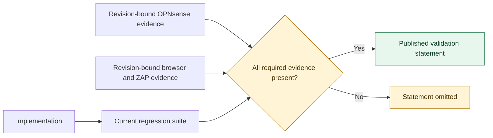

<!-- Generated by tests/update-security-report.py; do not edit this file manually. -->
# Security and conformance

Copyright (C) 2026 Julian Pawlowski. All rights reserved. BSD-2-Clause, see LICENSE at the repository root.

This is the single publication point for supported standards, provider interoperability,
security comparison, threat controls and validation evidence. Standards conformance and
provider compatibility remain separate claims; neither documentation nor an ordinary
regression test becomes a green conformance statement by implication.

## Standards and provider capabilities

This report deliberately starts conservative. A feature is green only after the exact relying-party profile has a
complete inventory of all applicable normative requirements and the required positive and negative evidence. Existing
implementation tests do not become standards claims merely because they pass.

Catalog boundary (reviewed 2026-08-24): Published OpenID Connect, directly supporting JOSE/SET, and OAuth specifications that can affect a confidential server-side web RP; active framework drafts are included only when they materially describe this profile.
Excluded families: Digital credentials, native/mobile identity, financial API resource access, transaction authorization and unrelated assertion ecosystems are represented by their applicable umbrella profile or excluded when they assign no meaningful role to this RP.
Source indexes: [https://openid.net/developers/specs/](https://openid.net/developers/specs/), [https://oauth.net/specs/](https://oauth.net/specs/).

Provider interoperability is a separate claim. A dated live result remains a historical result for the tested service
revision; it does not expire automatically and does not silently prove later revisions.

### Standards catalog

| Standard or profile | RP scope | Implementation | Conformance | Reason or next condition |
|---|---|---:|---:|---|
| [OpenID Connect Core 1.0 — Authorization Code Flow](https://openid.net/specs/openid-connect-core-1_0.html) | Web RP using the Authorization Code Flow | Implemented | 🟡 unverified | Implemented, but no green claim is allowed until every applicable RP requirement is inventoried and evidenced. |
| [OpenID Connect Core 1.0 — UserInfo](https://openid.net/specs/openid-connect-core-1_0.html#UserInfo) | RP consuming UserInfo responses when configured | Implemented | 🟡 unverified | The optional endpoint is implemented; its complete normative RP inventory is still required. |
| [OpenID Connect Discovery 1.0](https://openid.net/specs/openid-connect-discovery-1_0.html) | RP discovery and issuer validation | Implemented | 🟡 unverified | Discovery is implemented with exact issuer matching; requirement-level evidence is incomplete. |
| [OAuth 2.0 Authorization Framework (RFC 6749)](https://www.rfc-editor.org/rfc/rfc6749.html) | Confidential web client portions used by OIDC code flow | Implemented | ✅ verified | Verified for a confidential server-side web client using only the authorization-code grant; authorization-server, resource-server and other-grant behavior is outside this claim. |
| [OAuth 2.0 Bearer Token Usage (RFC 6750)](https://www.rfc-editor.org/rfc/rfc6750.html) | Bearer access token sent by the RP to the UserInfo endpoint | Implemented | ✅ verified | Verified for client-side Bearer header use at the protected UserInfo resource; token issuance, resource-server responses and revocation form semantics are outside this claim. |
| [OAuth 2.0 Token Revocation (RFC 7009)](https://www.rfc-editor.org/rfc/rfc7009.html) | RP revoking tokens during logout | Implemented | 🟡 unverified | Implemented as a logout cleanup mechanism; normative evidence is incomplete. |
| [Proof Key for Code Exchange (RFC 7636)](https://www.rfc-editor.org/rfc/rfc7636.html) | S256 authorization-code binding for a confidential web client | Implemented | 🟡 unverified | S256 is mandatory in the implementation; requirement-level evidence is incomplete. |
| [OAuth 2.0 Authorization Server Metadata (RFC 8414)](https://www.rfc-editor.org/rfc/rfc8414.html) | Metadata consumed through OIDC Discovery | Implemented | 🟡 unverified | The applicable confidential-web-RP metadata is inventoried, validated and negotiated; normative conformance evidence remains incomplete. |
| [JSON Web Token Best Current Practices (RFC 8725)](https://www.rfc-editor.org/rfc/rfc8725.html) | JWT validation by the RP | Implemented | 🟡 unverified | Defensive JWT validation exists; the cross-specification normative audit is not complete. |
| [OAuth 2.0 Pushed Authorization Requests (RFC 9126)](https://www.rfc-editor.org/rfc/rfc9126.html) | RP sending pushed authorization requests | Implemented | 🟡 unverified | Supported in automatic and required modes; requirement-level evidence is incomplete. |
| [OAuth 2.0 Authorization Server Issuer Identification (RFC 9207)](https://www.rfc-editor.org/rfc/rfc9207.html) | RP validating the authorization response issuer | Implemented | 🟡 unverified | Issuer response validation exists; requirement-level evidence is incomplete. |
| [Best Current Practice for OAuth 2.0 Security (RFC 9700)](https://www.rfc-editor.org/rfc/rfc9700.html) | Confidential browser-based RP | Implemented | ✅ verified | The applicable confidential web RP requirements are inventoried and backed by current positive and refusal evidence; reviewed deviations are explicit. |
| [OpenID Connect RP-Initiated Logout 1.0](https://openid.net/specs/openid-connect-rpinitiated-1_0.html) | RP initiating provider logout | Implemented | 🟡 unverified | Implemented when the provider advertises an end-session endpoint; normative evidence is incomplete. |
| [OpenID Connect Front-Channel Logout 1.0](https://openid.net/specs/openid-connect-frontchannel-1_0.html) | RP receiving front-channel logout notifications | Implemented | 🟡 unverified | Implemented with issuer and session binding; normative evidence is incomplete. |
| [OpenID Connect Back-Channel Logout 1.0](https://openid.net/specs/openid-connect-backchannel-1_0.html) | RP receiving logout tokens | Implemented | 🟡 unverified | Implemented with logout-token replay protection; normative evidence is incomplete. |
| [OpenID Shared Signals Framework 1.0](https://openid.net/specs/openid-sharedsignals-framework-1_0-final.html) | Managed push and poll stream receiver | Partial | 🟡 unverified | Discovery-driven configuration and status lifecycle, bounded push and explicit poll delivery are implemented; subject and verification management remain outside the current profile. |
| [OpenID Continuous Access Evaluation Profile 1.0](https://openid.net/specs/openid-caep-1_0-final.html) | Selected session-affecting events received over Shared Signals | Partial | 🟡 unverified | Only events that can safely invalidate a local WebGUI session are consumed. |
| [OpenID RISC Profile 1.0](https://openid.net/specs/openid-risc-1_0-final.html) | Selected account-risk events received over Shared Signals | Partial | 🟡 unverified | The complete event matrix is audited; seven account-risk events with an exact matchable user subject end only pre-event local sessions. |
| [OpenID Connect Session Management 1.0](https://openid.net/specs/openid-connect-session-1_0.html) | Browser session-state monitoring | Not planned | — not claimed | Iframe polling is not required for firewall WebGUI sign-in; explicit and provider-initiated logout are safer fits. Reconsider: A supported provider requires session-state monitoring and it can be isolated from the WebGUI. |
| [OpenID Connect Dynamic Client Registration 1.0 / RFC 7591](https://openid.net/specs/openid-connect-registration-1_0.html) | Automated client registration | Not planned | — not claimed | Firewall administrators deliberately provision and review a confidential client; automatic registration widens authority. Reconsider: A deployment model can preserve explicit administrative approval and credential custody. |
| [OAuth 2.0 Dynamic Client Registration Management (RFC 7592)](https://www.rfc-editor.org/rfc/rfc7592.html) | Automated client configuration management | N/A | N/A | No dynamically registered client is managed. |
| [OAuth 2.0 Token Introspection (RFC 7662)](https://www.rfc-editor.org/rfc/rfc7662.html) | Resource server token validation | N/A | N/A | The plugin is an OIDC relying party, not an OAuth resource server. |
| [OAuth 2.0 Device Authorization Grant (RFC 8628)](https://www.rfc-editor.org/rfc/rfc8628.html) | Input-constrained devices | N/A | N/A | The OPNsense WebGUI is an interactive browser client. |
| [OAuth 2.0 Token Exchange (RFC 8693)](https://www.rfc-editor.org/rfc/rfc8693.html) | Security-token exchange | N/A | N/A | The RP authenticates a browser session and does not broker tokens to downstream services. |
| [OAuth 2.0 Mutual-TLS Client Authentication and Certificate-Bound Tokens (RFC 8705)](https://www.rfc-editor.org/rfc/rfc8705.html) | Token endpoint client authentication and sender-constrained tokens | Deferred | — not claimed | Certificate lifecycle and a safely bounded HTTP client configuration are not yet available. Reconsider: OPNsense can provide reviewed per-provider client-certificate custody and rotation. |
| [JWT Profile for OAuth 2.0 Client Authentication (RFC 7523)](https://www.rfc-editor.org/rfc/rfc7523.html) | private_key_jwt client authentication | Candidate | — not claimed | Useful for providers that discourage static client secrets, but requires signing-key lifecycle design. Reconsider: A reviewed signing-key storage and rotation design exists. |
| [JWT-Secured Authorization Request (RFC 9101)](https://www.rfc-editor.org/rfc/rfc9101.html) | Signed authorization requests; encrypted Request Objects are outside this RP profile | Implemented | 🟡 unverified | Signed Request Objects are supported directly and through PAR with explicit OPNsense certificate selection and rotation; requirement-level evidence is incomplete. |
| [JWT Secured Authorization Response Mode (JARM)](https://openid.net/specs/oauth-v2-jarm.html) | Signed authorization responses | Implemented | 🟡 unverified | Signed query and Form POST responses are implemented; encrypted JARM remains outside the supported profile and the normative evidence inventory is incomplete. |
| [OAuth 2.0 Rich Authorization Requests (RFC 9396)](https://www.rfc-editor.org/rfc/rfc9396.html) | Fine-grained API authorization data | N/A | N/A | The RP requests identity claims for WebGUI login, not transaction-specific API authority. |
| [OAuth 2.0 Demonstrating Proof of Possession (RFC 9449)](https://www.rfc-editor.org/rfc/rfc9449.html) | Sender-constrained access and refresh tokens | Candidate | — not claimed | Could reduce token replay but requires provider support and secure RP key lifecycle. Reconsider: Interoperable provider demand and a reviewed key-rotation design exist. |
| [OpenID Connect Client-Initiated Backchannel Authentication (CIBA) Core 1.0](https://openid.net/specs/openid-client-initiated-backchannel-authentication-core-1_0.html) | Decoupled authentication | N/A | N/A | The WebGUI uses an immediate browser redirect and requires no decoupled approval channel. |
| [Financial-grade API 1.0 — Advanced Final](https://openid.net/specs/openid-financial-api-part-2-1_0.html) | High-value API access | N/A | N/A | This project authenticates a firewall WebGUI and is not a financial API client. |
| [FAPI 2.0 Security Profile](https://openid.net/specs/fapi-security-profile-2_0.html) | High-security API client profile | N/A | N/A | The profile targets protected APIs and requires mechanisms outside this WebGUI RP use case. |
| [OpenID Connect for Identity Assurance 1.0](https://openid.net/specs/openid-connect-4-identity-assurance-1_0.html) | Verified identity evidence and claims | N/A | N/A | Local account admission uses stable identity and configured claims, not regulated identity evidence. |
| [OpenID Federation 1.0](https://openid.net/specs/openid-federation-1_0.html) | Federation entity statements and trust chains | Not planned | — not claimed | Each firewall administrator explicitly configures one trusted issuer; automatic trust-chain expansion conflicts with that boundary. Reconsider: A deployment requires federation trust chains with an explicit local trust-anchor policy. |
| [OpenID Connect Third-Party Initiated Login 1.0](https://openid.net/specs/openid-connect-third-party-initiated-login-1_0.html) | Login initiated outside the RP | Not planned | — not claimed | The firewall keeps login initiation local so redirect targets and provider selection remain bounded. Reconsider: A safe, allow-listed initiation model has a concrete operator need. |
| [OAuth 2.0 for Native Apps (RFC 8252)](https://www.rfc-editor.org/rfc/rfc8252.html) | Native application authorization | N/A | N/A | The RP is a server-side WebGUI, not an installed application. |
| [JWT Profile for OAuth 2.0 Access Tokens (RFC 9068)](https://www.rfc-editor.org/rfc/rfc9068.html) | Resource server validation of JWT access tokens | N/A | N/A | The plugin treats access tokens as opaque credentials and is not the protected resource server. |
| [OAuth 2.0 Form Post Response Mode](https://openid.net/specs/oauth-v2-form-post-response-mode-1_0.html) | RP receiving an authorization response by cross-origin form POST | Implemented | 🟡 unverified | Implemented for providers such as Apple; requirement-level evidence is incomplete. |
| [JSON Web Signature (RFC 7515)](https://www.rfc-editor.org/rfc/rfc7515.html) | RP verification of signed ID, logout and security-event tokens | Implemented | 🟡 unverified | Signature verification uses the platform cryptographic runtime; the applicable validation inventory is incomplete. |
| [JSON Web Key (RFC 7517)](https://www.rfc-editor.org/rfc/rfc7517.html) | RP selection and validation of provider signing keys | Implemented | 🟡 unverified | The asymmetric verification profile enforces public key type, curve, size, use, operations and algorithm binding; the full JWK normative inventory remains incomplete. |
| [JSON Web Algorithms (RFC 7518)](https://www.rfc-editor.org/rfc/rfc7518.html) | RS256/384/512, PS256/384/512 and ES256/384/512 JWS verification with public RSA and EC JWKs | Implemented | 🟡 unverified | The named asymmetric JWS verification subset is implemented and structurally tested, but the normative digest, padding and successful cryptographic verification evidence is not complete for every 384/512 variant. HMAC, unsecured JWS, JWE and all other algorithm families remain outside the profile. |
| [CFRG EdDSA Signatures in JOSE (RFC 8037)](https://www.rfc-editor.org/rfc/rfc8037.html) | EdDSA JWS verification with public Ed25519 OKP JWKs | Implemented | ✅ verified | Verified only for public Ed25519 signature verification; Ed448, X25519/X448 key agreement and all signing roles are outside this claim. |
| [JSON Web Token (RFC 7519)](https://www.rfc-editor.org/rfc/rfc7519.html) | RP processing of signed protocol tokens | Implemented | 🟡 unverified | JWT parsing and claim validation are implemented; cross-profile normative evidence is incomplete. |
| [JSON Web Encryption (RFC 7516)](https://www.rfc-editor.org/rfc/rfc7516.html) | Encrypted ID Tokens, UserInfo or request objects | Not planned | — not claimed | TLS protects transport and the RP accepts only signed protocol tokens; decryption would add private-key custody and algorithm surface. Reconsider: A target provider requires encrypted OIDC messages and reviewed decryption-key lifecycle support exists. |
| [OpenID Connect Core 1.0 — Implicit Flow](https://openid.net/specs/openid-connect-core-1_0.html#ImplicitFlowAuth) | Tokens returned through the browser authorization response | Not planned | — not claimed | The code flow keeps tokens out of browser URLs and is the profile recommended by current OAuth security guidance. |
| [OpenID Connect Core 1.0 — Hybrid Flow](https://openid.net/specs/openid-connect-core-1_0.html#HybridFlowAuth) | Code and tokens returned through the authorization response | Not planned | — not claimed | The server-side code flow supplies the needed login result without exposing tokens through the browser. |
| [OAuth 2.0 Resource Owner Password Credentials Grant (RFC 6749 section 4.3)](https://www.rfc-editor.org/rfc/rfc6749.html#section-4.3) | RP collecting a provider password | Not planned | — not claimed | The firewall must never collect the identity-provider password; RFC 9700 prohibits this grant. |
| [OAuth 2.0 Client Credentials Grant (RFC 6749 section 4.4)](https://www.rfc-editor.org/rfc/rfc6749.html#section-4.4) | Machine identity without an end-user | N/A | N/A | The plugin authenticates a human WebGUI session. |
| [OAuth 2.0 Resource Indicators (RFC 8707)](https://www.rfc-editor.org/rfc/rfc8707.html) | Selecting a protected-resource audience | N/A | N/A | The login flow consumes identity information and does not select among downstream resource servers. |
| [REFEDS Multi-Factor Authentication Profile](https://refeds.org/profile/mfa) | RP requesting and validating a common MFA authentication context | Implemented | 🟡 unverified | The context is supported together with method evidence; profile-level evidence is incomplete. |
| [OpenID Connect Extended Authentication Profile (EAP) ACR Values 1.0](https://openid.net/specs/openid-connect-eap-acr-values-1_0.html) | RP requesting phishing-resistant authentication contexts | Implemented | 🟡 unverified | The phr and phrh contexts are supported together with method evidence; normative evidence is incomplete. |
| [Authentication Method Reference Values (RFC 8176)](https://www.rfc-editor.org/rfc/rfc8176.html) | RP interpretation of bounded signed authentication-method evidence | Implemented | 🟡 unverified | Every registered value is classified as direct, factor-specific or non-elevating evidence; normative evidence is incomplete. |
| [Security Event Token (RFC 8417)](https://www.rfc-editor.org/rfc/rfc8417.html) | RP verification of signed Shared Signals security events | Implemented | 🟡 unverified | Signed SET validation is implemented for the bounded receiver profile; normative evidence is incomplete. |
| [Push-Based Security Event Token Delivery (RFC 8935)](https://www.rfc-editor.org/rfc/rfc8935.html) | Push delivery to the RP Shared Signals receiver | Implemented | 🟡 unverified | Authenticated push delivery and explicit response handling are implemented; normative evidence is incomplete. |
| [Poll-Based Security Event Token Delivery (RFC 8936)](https://www.rfc-editor.org/rfc/rfc8936.html) | Explicit short-poll delivery to the RP Shared Signals receiver | Implemented | 🟡 unverified | Bounded polling, validation-aware acknowledgement and error reporting are implemented; normative evidence is incomplete. |
| [OAuth 2.0 for Browser-Based Applications (RFC 10017)](https://www.rfc-editor.org/rfc/rfc10017.html) | JavaScript applications executing the OAuth client in a browser | N/A | N/A | The OAuth client and tokens remain server-side; the browser is not the OAuth client. |
| [Best Current Practice for Security of Cross-Device Flows (RFC 10027)](https://www.rfc-editor.org/rfc/rfc10027.html) | Authorization split across two devices | N/A | N/A | The WebGUI login starts and completes in one browser session. |
| [OAuth 2.0 Protected Resource Metadata (RFC 9728)](https://www.rfc-editor.org/rfc/rfc9728.html) | Protected-resource metadata discovery | N/A | N/A | The plugin is not an OAuth protected resource. |
| [JWT Response for OAuth Token Introspection (RFC 9701)](https://www.rfc-editor.org/rfc/rfc9701.html) | Protected resource consuming token-introspection responses | N/A | N/A | The RP neither introspects tokens nor validates them as a protected resource. |
| [OAuth 2.0 Step Up Authentication Challenge Protocol (RFC 9470)](https://www.rfc-editor.org/rfc/rfc9470.html) | Resource server demanding stronger authorization from an API client | N/A | N/A | Authentication strength is selected before WebGUI login; no downstream resource server issues step-up challenges. |
| [JWK Thumbprint URI (RFC 9278)](https://www.rfc-editor.org/rfc/rfc9278.html) | URI identification of proof-of-possession keys | N/A | N/A | The current RP profile uses neither DPoP nor another JWK-thumbprint URI protocol field. |
| [Proof-of-Possession Key Semantics for JWTs (RFC 7800)](https://www.rfc-editor.org/rfc/rfc7800.html) | JWT confirmation claims for proof-of-possession keys | N/A | N/A | The RP does not consume proof-of-possession access tokens. |
| [Assertion Framework for OAuth 2.0 (RFC 7521)](https://www.rfc-editor.org/rfc/rfc7521.html) | Assertion grants and client authentication | Candidate | — not claimed | Only its JWT client-authentication profile is a potential future fit; assertion grants are outside WebGUI login. Reconsider: private_key_jwt key custody and rotation are implemented. |
| [SAML 2.0 Profile for OAuth 2.0 Assertions (RFC 7522)](https://www.rfc-editor.org/rfc/rfc7522.html) | SAML assertion grant or client authentication | N/A | N/A | The provider boundary is OpenID Connect and does not accept SAML assertions. |
| [OAuth 2.0 Threat Model and Security Considerations (RFC 6819)](https://www.rfc-editor.org/rfc/rfc6819.html) | Historic OAuth security guidance | N/A | N/A | RFC 9700 is the current Best Current Practice and explicitly updates the security baseline used by this profile. |
| [IETF URN Sub-Namespace for OAuth (RFC 6755)](https://www.rfc-editor.org/rfc/rfc6755.html) | Registry namespace allocation | N/A | N/A | This registry document assigns no runtime behaviour to the RP. |
| [OAuth 2.1 Authorization Framework (active IETF draft)](https://datatracker.ietf.org/doc/draft-ietf-oauth-v2-1/) | Consolidated authorization-code profile for a confidential web client | Partial | — not claimed | The design already follows many consolidated security requirements, but the document remains an active draft and is not an RFC conformance target. Reconsider: The specification is published or a provider requires a pinned draft profile. |

### OAuth 2.1 Authorization Framework (active IETF draft) tracking

Informative only: `draft-ietf-oauth-v2-1-15` was reviewed 2026-08-24; no draft conformance is claimed.

| Draft difference | RP status | Current disposition |
|---|---:|---|
| Authorization Code flow incorporates mandatory PKCE parameters (Section 10) | Aligned | Every login sends a transaction-specific S256 challenge and proves the exact verifier at the token endpoint. |
| Registered redirect URIs use exact string matching (Section 10) | Aligned | The RP emits only exact configured HTTPS callbacks and refuses a callback under another origin or application code. |
| The Implicit grant is omitted (Sections 10 and 10.1) | Aligned | The RP requests only code and now rejects any front-channel access or ID token even when a code is also present. |
| The Resource Owner Password Credentials grant is omitted (Section 10) | Aligned | The firewall never accepts or sends identity-provider usernames or passwords; only an authorization code is exchanged. |
| Bearer token use in URI query strings is omitted (Section 10) | Aligned | UserInfo receives its access token only in the Authorization header and revocation receives the token in a POST body. |
| Public-client refresh tokens require sender constraint or rotation (Section 10) | N/A | This RP is a confidential server-side client and never refreshes an access token during the WebGUI session. |
| The authorization-code token request omits redirect_uri (Sections 10 and 10.2) | Differs | The current published OIDC and OAuth 2.0 profile sends the exact frozen redirect_uri for provider interoperability; reconsider only after OAuth 2.1 is stable and the OIDC relationship is resolved. |
| Authorization servers support client credentials in the request body (Section 10) | N/A | This requirement is assigned to the provider. The RP supports client_secret_post when advertised or configured but makes no server-conformance claim. |

### Provider interoperability matrix

The cells describe provider evidence, not plugin standards conformance: ✅ retained live test; 🟦 retained live test
with a named adapter; 📘 vendor documentation only; ◇ conditional; ❌ unavailable; ⚠️ incompatible; ? unknown.
A provider guide alone is never rendered green.

| Provider | OIDC code login | PKCE S256 | PAR | Authorization issuer | Signed JARM | Token revocation | RP-initiated logout | Front-channel logout | Back-channel logout | Shared Signals | MFA evidence | Phishing-resistant evidence |
|---|---:|---:|---:|---:|---:|---:|---:|---:|---:|---:|---:|---:|
| [Generic OpenID Connect](../providers/general.md) | [◇](https://openid.net/specs/openid-connect-core-1_0.html) | [◇](https://www.rfc-editor.org/rfc/rfc9700.html) | [◇](https://www.rfc-editor.org/rfc/rfc9126.html) | [◇](https://www.rfc-editor.org/rfc/rfc9207.html) | [◇](https://openid.net/specs/oauth-v2-jarm.html) | [◇](https://www.rfc-editor.org/rfc/rfc7009.html) | [◇](https://openid.net/specs/openid-connect-rpinitiated-1_0.html) | [◇](https://openid.net/specs/openid-connect-frontchannel-1_0.html) | [◇](https://openid.net/specs/openid-connect-backchannel-1_0.html) | [◇](https://openid.net/specs/openid-sharedsignals-framework-1_0-final.html) | [◇](https://refeds.org/profile/mfa) | [◇](https://openid.net/specs/openid-connect-eap-acr-values-1_0.html) |
| [Auth0](../providers/auth0.md) | [📘](https://auth0.com/docs/get-started/authentication-and-authorization-flow/authorization-code-flow) | ? | ? | ? | ? | ? | ? | ? | ? | ? | ? | ? |
| [Authelia](../providers/authelia.md) | [📘](https://www.authelia.com/integration/openid-connect/introduction/) | [📘](https://www.authelia.com/configuration/identity-providers/openid-connect/clients/) | ? | ? | ? | ? | ? | ? | ? | ? | ? | ? |
| [authentik](../providers/authentik.md) | [📘](https://docs.goauthentik.io/add-secure-apps/providers/oauth2/) | ? | ? | ? | ? | ? | [📘](https://docs.goauthentik.io/add-secure-apps/providers/oauth2/frontchannel_and_backchannel_logout/) | [◇](https://docs.goauthentik.io/add-secure-apps/providers/oauth2/frontchannel_and_backchannel_logout/) | [◇](https://docs.goauthentik.io/add-secure-apps/providers/oauth2/frontchannel_and_backchannel_logout/) | ? | ? | ? |
| [AWS Cognito](../providers/cognito.md) | [📘](https://docs.aws.amazon.com/cognito/latest/developerguide/authorization-endpoint.html) | ? | ? | ? | ? | ? | ? | ? | ? | ? | ? | ? |
| [Cisco Duo Single Sign-On](../providers/duo.md) | [📘](https://duo.com/docs/sso-oauth-server) | [📘](https://duo.com/docs/sso-oauth-server) | ? | ? | ? | ? | ? | ? | ? | ? | ? | ? |
| [Dex](../providers/dex.md) | [📘](https://dexidp.io/docs/configuration/custom-scopes-claims-clients/) | ? | ? | ? | ? | ? | ? | ? | ? | ? | ? | ? |
| [FusionAuth](../providers/fusionauth.md) | [📘](https://fusionauth.io/docs/lifecycle/authenticate-users/oauth/) | [📘](https://fusionauth.io/docs/lifecycle/authenticate-users/oauth/) | ? | ? | ? | ? | ? | ? | ? | ? | ? | ? |
| [GitLab](../providers/gitlab.md) | [📘](https://docs.gitlab.com/integration/openid_connect_provider/) | ? | ? | ? | ? | ? | ? | ? | ? | ? | ? | ? |
| [Google / Workspace](../providers/google.md) | [📘](https://developers.google.com/identity/openid-connect/openid-connect) | ? | ? | ? | ? | ? | ? | ? | ? | ? | ? | ? |
| [IBM Security Verify](../providers/ibm-verify.md) | [📘](https://docs.verify.ibm.com/gateway/docs/tasks-oidc-rp-verify) | ? | ? | ? | ? | ? | ? | ? | ? | ? | ? | ? |
| [JumpCloud](../providers/jumpcloud.md) | [📘](https://jumpcloud.com/support/sso-with-oidc) | [📘](https://jumpcloud.com/support/sso-with-oidc) | ? | ? | ? | ? | ? | ? | ? | ? | ? | ? |
| [Keycloak](../providers/keycloak.md) | [📘](https://www.keycloak.org/docs/latest/server_admin/) | [📘](https://www.keycloak.org/docs/latest/server_admin/) | ? | ? | [📘](https://www.keycloak.org/docs-api/latest/javadocs/org/keycloak/protocol/oidc/utils/OIDCResponseMode.html) | ? | [📘](https://www.keycloak.org/docs/latest/server_admin/) | [📘](https://www.keycloak.org/docs/latest/server_admin/) | [📘](https://www.keycloak.org/docs/latest/server_admin/) | ? | ? | ? |
| [Microsoft Entra ID](../providers/entra-id.md) | [📘](https://learn.microsoft.com/en-us/entra/identity-platform/v2-protocols-oidc) | ? | ? | ? | ? | ? | ? | [◇](https://learn.microsoft.com/en-us/entra/identity-platform/v2-protocols-oidc) | [◇](https://learn.microsoft.com/en-us/entra/identity-platform/v2-protocols-oidc) | ? | [📘](https://learn.microsoft.com/en-us/entra/identity-platform/developer-guide-conditional-access-authentication-context) | [📘](https://learn.microsoft.com/en-us/entra/identity-platform/developer-guide-conditional-access-authentication-context) |
| [Okta](../providers/okta.md) | [📘](https://developer.okta.com/docs/guides/sign-into-web-app-redirect/main/) | ? | ? | ? | ? | ? | ? | ? | ? | [◇](https://developer.okta.com/docs/reference/ssf-transmitter-sets/) | [📘](https://developer.okta.com/docs/guides/step-up-authentication/main/) | [📘](https://developer.okta.com/docs/guides/step-up-authentication/main/) |
| [OneLogin](../providers/onelogin.md) | [📘](https://developers.onelogin.com/openid-connect/api/authorization-code) | ? | ? | ? | ? | ? | ? | ? | ? | ? | ? | ? |
| [Oracle Identity Cloud / OCI IAM](../providers/oracle-idcs.md) | [📘](https://docs.oracle.com/en/cloud/paas/identity-cloud/idcsa/AuthCodeGT.html) | ? | ? | ? | ? | ? | ? | ? | ? | ? | ? | ? |
| [Ping Identity](../providers/ping.md) | [📘](https://docs.pingidentity.com/pingone/pingone_tutorials/p1_tutorial_integrate_nodejs_express_app.html) | ? | ? | ? | ? | ? | ? | ? | ? | ? | ? | ? |
| [Pocket ID](../providers/pocketid.md) | [📘](https://pocket-id.org/docs/guides/client-id-metadata-documents) | ? | ? | ? | ? | ? | ? | ? | ? | ? | ? | ? |
| [Apple](../providers/apple.md) | [📘](https://developer.apple.com/help/account/capabilities/configure-sign-in-with-apple-for-the-web/) | ? | ? | ? | ? | ? | ? | ? | ? | ? | ? | ? |
| [WSO2 Identity Server](../providers/wso2.md) | [📘](https://is.docs.wso2.com/en/latest/guides/authentication/oidc/) | [📘](https://is.docs.wso2.com/en/latest/guides/authentication/oidc/) | ? | ? | ? | ? | ? | ? | ? | ? | ? | ? |
| [ZITADEL](../providers/zitadel.md) | [📘](https://zitadel.com/docs/guides/integrate/login/login-users) | [📘](https://zitadel.com/docs/guides/integrate/login/login-users) | ? | ? | ? | ? | [📘](https://zitadel.com/docs/guides/integrate/login/login-users) | ? | ? | ? | ? | ? |
| [LinkedIn](../providers/linkedin.md) | [📘](https://learn.microsoft.com/en-us/linkedin/consumer/integrations/self-serve/sign-in-with-linkedin-v2) | ? | ? | ? | ? | ? | ? | ? | ? | ? | ? | ? |
| [Slack](../providers/slack.md) | [📘](https://api.slack.com/authentication/sign-in-with-slack) | ? | ? | ? | ? | ? | ? | ? | ? | ? | ? | ? |
| [Yahoo](../providers/yahoo.md) | [📘](https://developer.yahoo.com/oauth2/guide/openid_connect/) | ? | ? | ? | ? | ? | ? | ? | ? | ? | ? | ? |
| [ORCID](../providers/orcid.md) | [📘](https://github.com/ORCID/ORCID-Source/blob/main/orcid-web/ORCID_AUTH_WITH_OPENID_CONNECT.md) | ? | ? | ? | ? | ? | ? | ? | ? | ? | ? | ? |

### Verified security comparison

The comparison uses only security features for which the plugin has a verified standards claim and the provider has
retained live evidence. Vendor adaptations do not become standard-conformant green cells. The result is a Pareto
frontier instead of a numeric score that hides trade-offs.

Security dimensions reserved for that comparison: PKCE S256, PAR, Authorization issuer, Signed JARM, Token revocation, Front-channel logout, Back-channel logout, Shared Signals, MFA evidence, Phishing-resistant evidence.

Current result: no provider is ranked because no security dimension has passed the normative gate.

### How a cell becomes green

1. Fix the exact specification version, RP role, feature profile and applicability boundary.
2. Inventory every normative MUST, MUST NOT, SHOULD, SHOULD NOT and claimed MAY with a stable requirement ID.
3. Give every applicable MUST and MUST NOT positive and negative evidence. Test a SHOULD likewise or record a reviewed deviation.
4. Let the catalog validator reject incomplete inventories and broken evidence references.
5. For a provider cell, retain the provider revision, test date, configuration and result. Record vendor adaptations separately.

The OIDF conformance suite may add useful independent evidence, but an internal result is not represented as OpenID
certification. Contradictory newer evidence supersedes a claim explicitly; the passage of time alone does not.

## Threats and controls

| Threat | Control |
|---|---|
| forged/replayed callback | random server-bound state, nonce and PKCE; state consumed before processing; bounded one-time server index for Form POST modes under SameSite=Lax; PAR keeps the complete request server-to-server when advertised |
| authorization request tampering or replay | optional or provider-required RFC 9101 signature over every authorization parameter; exact client/issuer audience binding, explicit JWT type, registered key `kid`, 60-second expiry and fresh `jti`; outer request carries only the matching client ID and `request` or provider-issued PAR reference |
| forged or downgraded JARM response | the requested signed mode is frozen into the one-time transaction; asymmetric signature, advertised algorithm, exact issuer/audience, time, state and transport are checked before code or error processing |
| authorization-server mix-up | frozen exact issuer/endpoints, distinct callback per provider, RFC 9207 when advertised and signed JARM issuer/audience binding when selected |
| forged ID Token | verified RS/PS/ES/Ed25519 JWKS signature profile, public-key type/curve/size/use/operations/algorithm binding, 2048–8192-bit RSA bound |
| provider ignores or misinterprets a requested authentication strength | an enabled requirement needs exact signed `acr`/`acrs` context and bounded `amr` evidence frozen into the login transaction; missing or mismatched evidence is refused before account lookup |
| token for another client | exact `aud` and `azp` rules |
| stale/future token | strict integer `exp`, `iat`, optional `nbf`, 60-second clock tolerance |
| UserInfo substitution | access token over TLS, credential redirects forbidden, exact ID Token/UserInfo `sub` binding |
| open redirect/Host injection | local target sanitizer, strict Host grammar, HTTPS origin matched to OPNsense hostname/domain, alternate hostnames and core's IP-literal rule, or to an explicit exact custom list; disabling OPNsense DNS-rebinding checks does not widen hostname acceptance |
| HTTP WebGUI or forged proxy scheme | native HTTP blocks enabled providers and sign-in tests; TLS offloading requires an explicit per-provider exception, exact custom HTTPS origins and exact Host matching; forwarded scheme headers and PROXY protocol are not treated as TLS proof |
| session fixation | fail-closed PHP session ID regeneration with old ID removal after elevation |
| identity reassignment after rename | persistent exact `(issuer, sub)` to numeric UID binding |
| unverified e-mail takeover | strict admission by default; automatic e-mail admission requires a unique verified address unless unsafe matching is explicitly selected |
| any global social account reaches the firewall | unknown identities are refused with the same public response as every unusable account; Administrator approval privately queues an exact issuer/subject without a session, with bounded 0600 storage and no unauthenticated config write |
| unauthorized identity rebinding or account creation | the manager API extends core's System: Authentication Servers ACL, repeats that privilege check in the controller and applies `user-config-readonly` to every mutation; inline accounts additionally require core's System: Access: Management privilege, start with a scrambled password and receive no groups or privileges; binding operations target one exact saved server and use record IDs to detect concurrent changes |
| Microsoft multitenant issuer substitution | Microsoft-only authority modes require GUID `tid`, exact tenant issuer, selected organizations/consumers population and matching signing-key issuer |
| provider grants excessive privilege | no group claim by default, explicit assignable local groups, root denied |
| logout forgery/replay | signed logout token, issuer/audience/event/integer `exp`/time/`jti`, replay cache retained through signed expiry, exact `sid`/`sub` lookup, bounded session-lock retry and retryable failure without consuming the replay marker |
| forged or replayed Shared Signals event | exact transmitter discovery issuer and audience, asymmetric SET signature, mandatory `secevent+jwt` type, pre-crypto bearer authentication, bounded `jti` digest cache and provider-and-issuer-scoped subject lookup |
| delayed security event ends a new session | each indexed session records its creation time; an event acts only on sessions present at `event_timestamp` or `iat`, with the fixed clock tolerance |
| credential leakage by HTTP redirect | POST and credential-bearing GET redirects rejected |
| resource exhaustion | response limits, field/key/claim limits, connection/total timeouts, bounded transaction/session/replay indexes and at most 100 deduplicated pending identities |
| account/configuration enumeration | every missing, disabled, expired, privileged or approval-pending account receives the same public refusal; precise reasons remain in the log |
| third-party content or administrator text on login page | named profiles use reviewed package-owned SVGs; custom remote icons are proxied by the firewall with content-type/size checks and an SVG sandbox; provider labels and custom wording are bounded plain text and HTML-escaped; no raw custom markup reaches the page |
| authorization codes, state, identity details or failure references retained or leaked by the browser | private responses use `no-store`, `no-referrer`, `nosniff` and a deny-by-default CSP; successful package-owned or proxied icons are the only cacheable plugin responses |

## Browser response security

Response headers complement the protocol controls above. State, nonce, PKCE and
token validation decide whether an OIDC response is authentic; browser headers
limit what happens to the resulting document, redirect or error after it has
been returned.

| Response class | Cache, referrer and MIME policy | Content and framing policy |
|---|---|---|
| Public login, callback, logout, back-channel logout and protocol errors | `Cache-Control: no-store`, legacy `Pragma: no-cache`, `Referrer-Policy: no-referrer`, `X-Content-Type-Options: nosniff` | deny-by-default CSP with `frame-ancestors 'none'` and `base-uri 'none'` |
| Public Shared Signals push success and error | same private policy; RFC 8935 success is empty `202`, validation errors are bounded JSON | deny-by-default CSP; no subject, token or claim value is reflected |
| Sign-in-test and WebGUI-access-denied pages | same private policy; cross-site `form_post` results also remove the temporary session's `Set-Cookie` | self-contained HTML; only inline styling is allowed, with all other sources, framing, base-URL changes and form submission denied |
| Front-channel logout | private policy | `default-src 'none'; frame-ancestors *` is an intentional exception because the provider must load this endpoint in an iframe |
| Successful package-owned or proxied login icon | `Cache-Control: public, max-age=86400`, `no-referrer`, `nosniff` | sandboxed image response; package assets are reviewed and self-contained; remote responses cannot execute as page markup |
| Missing, failed or rejected login icon | `no-store`, `no-referrer`, `nosniff`, explicit plain-text type | sandboxed deny-by-default CSP with framing denied |
| Authenticated Discovery, sign-in-test, provider-setup and identity-approval APIs | `no-store`, `Pragma: no-cache`, `no-referrer`, `nosniff` | JSON or download response; the headers are applied before core authentication and CSRF processing, so early `401`, `403` and redirects are covered too |

`Strict-Transport-Security` is intentionally not emitted by individual plugin
controllers. HSTS is a host-wide transport promise and belongs to the native
OPNsense WebGUI listener, or to the reverse proxy that terminates TLS. The same
boundary owns the WebGUI session cookie's `Secure`, `HttpOnly` and `SameSite`
attributes; under the explicit TLS-offload exception the proxy must add the
transport protection that an internal HTTP listener cannot infer safely.

The plugin uses CSP `frame-ancestors` instead of duplicating it with
`X-Frame-Options`, because front-channel logout needs one explicit framing
exception that `X-Frame-Options` cannot express consistently. Blanket
`Permissions-Policy`, COOP or COEP headers are not added: these static responses
do not request powerful browser features, while cross-origin isolation can
interfere with provider redirects and the required logout iframe without
strengthening OIDC validation.

The CSP from OPNsense core's `guiconfig.inc` protects normal WebGUI-rendered
pages only. Direct controller responses do not pass through that renderer, so
the plugin sets their complete policy itself before callback processing can
produce a redirect, stand-alone document or error.

The disposable browser E2E test adds an independent passive OWASP ZAP pass over
the real responses. Playwright reaches the stateful and authenticated outcomes;
ZAP parses only plugin traffic and applies an endpoint-aware failure policy.
The scanner therefore cannot replace the exact assertions above: host-owned
HSTS, JSON APIs, the front-channel iframe, inline styling and cacheable icons
have intentionally different requirements. The firewall may remain private and
use a self-signed WebGUI certificate because the proxy and browser run locally
inside the isolated test boundary.

## Accepted residual risks

- A compromised identity provider can authenticate its users and assert any
  configured group/role. Local scoping limits consequences but cannot restore
  trust in that provider.
- An administrator may configure an internal IdP. Blocking private IP space
  would break that supported deployment, so provider and custom icon URLs are
  privileged SSRF-capable settings. Named profile icons do not perform an
  outbound request. Only administrators with the relevant
  configuration/discovery permission should control custom URLs.
- Tokens needed for logout are present in the authenticated PHP session. A
  local root compromise or arbitrary WebGUI code execution already crosses the
  firewall's security boundary and can read them.
- Front-channel logout depends on browser iframe/CSP behaviour and is less
  reliable than back-channel logout. Prefer back-channel where available.
- Removing access at the provider does not end an already established local
  session unless the provider sends OIDC logout, an enabled supported Shared
  Signals event, or its normal OPNsense timeout ends.
- Under the explicit HTTP-backend TLS-offloading exception, reverse-proxy
  isolation and response-cookie hardening are administrator responsibilities.
  The plugin cannot prove that no alternate route reaches the listener.

## Release security

Every published package receives keyless GitHub/Sigstore build provenance bound
to its exact digest, this repository's release workflow and the source commit.
The workflow stages the complete asset set in a draft and publishes only once;
GitHub release immutability then locks both tag and assets and creates a separate
release attestation. Release notes put attestation, checksum and any optional
offline RSA verification before `pkg add`.

OPNsense `pkg` does not understand GitHub attestations for a directly supplied
file. Operators therefore verify provenance on an administrator workstation
before copying the package to the firewall. A checksum alone is only a transfer
integrity check. During beta there is deliberately no package repository,
repository trust fingerprint or automatic `pkg install` update path.

Do not publish client secrets, tokens, complete session files, or unredacted
provider responses in issues. See [SECURITY.md](../../SECURITY.md).

## Evidence-backed implementation controls

A property appears below only when every evidence tier required by
`tests/audit-controls.json` succeeds. This is a positive validation statement, not a
backlog, certification, independent penetration test or substitute for the stricter
requirement-level conformance gate above.

### Evidence model

The host-independent suite is executed for every regeneration. External evidence
is accepted only when it reports a complete passing execution from a clean source
revision and none of the control's implementation or validation files changed
after that revision.

Evidence contributing to this report:

- current host-independent regression suite

### OIDC and OAuth protocol validation

| Validated security property | Implementation | Validation evidence |
|---|---|---|
| Discovery accepts only a well-formed HTTPS document whose issuer exactly matches the configured authority and whose advertised endpoints and capabilities satisfy the supported profile. | [src/opnsense/mvc/app/library/OPNsense/OpenIDConnect/ProviderMetadata.php](../../src/opnsense/mvc/app/library/OPNsense/OpenIDConnect/ProviderMetadata.php) [src/opnsense/mvc/app/library/OPNsense/OpenIDConnect/HttpClient.php](../../src/opnsense/mvc/app/library/OPNsense/OpenIDConnect/HttpClient.php) | current host-independent regression suite: [tests/unit/exchange.php](../../tests/unit/exchange.php), [tests/unit/settings.php](../../tests/unit/settings.php) |
| Only validated public Discovery and JWKS responses enter bounded HTTP-aware caches; automatic PAR bypass is limited to temporary availability failures while provider-required PAR and every TLS, authentication or protocol error fail closed. | [src/opnsense/mvc/app/library/OPNsense/OpenIDConnect/ProviderCache.php](../../src/opnsense/mvc/app/library/OPNsense/OpenIDConnect/ProviderCache.php) [src/opnsense/mvc/app/library/OPNsense/OpenIDConnect/RelyingParty.php](../../src/opnsense/mvc/app/library/OPNsense/OpenIDConnect/RelyingParty.php) [src/opnsense/mvc/app/library/OPNsense/OpenIDConnect/ParClient.php](../../src/opnsense/mvc/app/library/OPNsense/OpenIDConnect/ParClient.php) | current host-independent regression suite: [tests/unit/exchange.php](../../tests/unit/exchange.php), [tests/unit/settings.php](../../tests/unit/settings.php) |
| A selected or provider-required RFC 9101 Request Object signs every authorization parameter with an advertised key-compatible algorithm, exact client and issuer binding, a 60-second lifetime and a fresh replay identifier; direct and PAR delivery duplicate only the matching client ID. | [src/opnsense/mvc/app/library/OPNsense/OpenIDConnect/RequestObjectSigner.php](../../src/opnsense/mvc/app/library/OPNsense/OpenIDConnect/RequestObjectSigner.php) [src/opnsense/mvc/app/library/OPNsense/OpenIDConnect/ProviderMetadata.php](../../src/opnsense/mvc/app/library/OPNsense/OpenIDConnect/ProviderMetadata.php) [src/opnsense/mvc/app/library/OPNsense/OpenIDConnect/RelyingParty.php](../../src/opnsense/mvc/app/library/OPNsense/OpenIDConnect/RelyingParty.php) [src/opnsense/mvc/app/library/OPNsense/OpenIDConnect/ParClient.php](../../src/opnsense/mvc/app/library/OPNsense/OpenIDConnect/ParClient.php) | current host-independent regression suite: [tests/unit/exchange.php](../../tests/unit/exchange.php), [tests/unit/settings.php](../../tests/unit/settings.php) |
| Every login uses the Authorization Code flow with random server-side state, nonce and PKCE S256, and binds the response to the intended provider callback. | [src/opnsense/mvc/app/library/OPNsense/OpenIDConnect/RelyingParty.php](../../src/opnsense/mvc/app/library/OPNsense/OpenIDConnect/RelyingParty.php) [src/opnsense/mvc/app/library/OPNsense/OpenIDConnect/TransactionRegistry.php](../../src/opnsense/mvc/app/library/OPNsense/OpenIDConnect/TransactionRegistry.php) | current host-independent regression suite: [tests/unit/exchange.php](../../tests/unit/exchange.php), [tests/unit/redirects.php](../../tests/unit/redirects.php) |
| Frozen provider metadata, distinct callbacks, RFC 9207 issuer checking when advertised and one-time transaction consumption prevent mix-up and callback replay. | [src/opnsense/mvc/app/library/OPNsense/OpenIDConnect/RelyingParty.php](../../src/opnsense/mvc/app/library/OPNsense/OpenIDConnect/RelyingParty.php) [src/opnsense/mvc/app/library/OPNsense/OpenIDConnect/ProviderMetadata.php](../../src/opnsense/mvc/app/library/OPNsense/OpenIDConnect/ProviderMetadata.php) | current host-independent regression suite: [tests/unit/exchange.php](../../tests/unit/exchange.php) |
| Provider communication is HTTPS-only and bounded by media-type, body-size, timeout and redirect rules that refuse credential-bearing redirects. | [src/opnsense/mvc/app/library/OPNsense/OpenIDConnect/HttpClient.php](../../src/opnsense/mvc/app/library/OPNsense/OpenIDConnect/HttpClient.php) | current host-independent regression suite: [tests/unit/exchange.php](../../tests/unit/exchange.php) |
| UserInfo data is accepted only over the protected provider transport and only when its subject exactly matches the validated ID Token subject. | [src/opnsense/mvc/app/library/OPNsense/OpenIDConnect/RelyingParty.php](../../src/opnsense/mvc/app/library/OPNsense/OpenIDConnect/RelyingParty.php) | current host-independent regression suite: [tests/unit/claims.php](../../tests/unit/claims.php), [tests/unit/exchange.php](../../tests/unit/exchange.php) |

### Local identity and authorization

| Validated security property | Implementation | Validation evidence |
|---|---|---|
| A durable identity binds the exact issuer and subject to a numeric local UID, so mutable usernames and e-mail addresses cannot silently reassign it. | [src/opnsense/mvc/app/library/OPNsense/Auth/OpenIDConnect.php](../../src/opnsense/mvc/app/library/OPNsense/Auth/OpenIDConnect.php) | current host-independent regression suite: [tests/unit/accounts.php](../../tests/unit/accounts.php) |
| Unknown, disabled, expired and privileged local accounts fail closed; strict admission and explicit administrator approval remain the safe paths. | [src/opnsense/mvc/app/library/OPNsense/Auth/OpenIDConnect.php](../../src/opnsense/mvc/app/library/OPNsense/Auth/OpenIDConnect.php) [src/opnsense/mvc/app/library/OPNsense/OpenIDConnect/PendingIdentityRegistry.php](../../src/opnsense/mvc/app/library/OPNsense/OpenIDConnect/PendingIdentityRegistry.php) | current host-independent regression suite: [tests/unit/accounts.php](../../tests/unit/accounts.php) |
| Provider-controlled groups are disabled by default and can affect only explicitly assignable local groups unless full delegation is deliberately enabled. | [src/opnsense/mvc/app/library/OPNsense/Auth/OpenIDConnect.php](../../src/opnsense/mvc/app/library/OPNsense/Auth/OpenIDConnect.php) | current host-independent regression suite: [tests/unit/groups.php](../../tests/unit/groups.php) |

### Session and logout security

| Validated security property | Implementation | Validation evidence |
|---|---|---|
| Logout and revocation grants are sent only after Discovery resolves the exact issuer stored with the local session, so reusing an authentication-server name for another issuer cannot receive earlier grants. | [src/opnsense/mvc/app/controllers/OPNsense/OpenIDConnect/Api/AuthController.php](../../src/opnsense/mvc/app/controllers/OPNsense/OpenIDConnect/Api/AuthController.php) [src/opnsense/mvc/app/library/OPNsense/OpenIDConnect/RelyingParty.php](../../src/opnsense/mvc/app/library/OPNsense/OpenIDConnect/RelyingParty.php) | current host-independent regression suite: [tests/unit/exchange.php](../../tests/unit/exchange.php) |

### Browser response security

| Validated security property | Implementation | Validation evidence |
|---|---|---|
| Provider labels remain escaped plain text and package or proxied icons are restricted to reviewed, bounded and sandboxed image content. | [src/opnsense/mvc/app/library/OPNsense/Auth/SSOProviders/OpenIDConnectContainer.php](../../src/opnsense/mvc/app/library/OPNsense/Auth/SSOProviders/OpenIDConnectContainer.php) [src/opnsense/mvc/app/controllers/OPNsense/OpenIDConnect/Api/AuthController.php](../../src/opnsense/mvc/app/controllers/OPNsense/OpenIDConnect/Api/AuthController.php) | current host-independent regression suite: [tests/unit/loginpage.php](../../tests/unit/loginpage.php), [tests/package.py](../../tests/package.py) |

### Package and provider onboarding integrity

| Validated security property | Implementation | Validation evidence |
|---|---|---|
| The package is built with a complete manifest, exact checksums, root ownership, constrained permissions and no bundled third-party OIDC client. | [packaging/build.py](../../packaging/build.py) | current host-independent regression suite: [tests/package.py](../../tests/package.py) |
| The release workflow attests the exact package built by a GitHub tag push, inventories all draft assets, refuses replacement of a published release, verifies immutability after publication and documents provenance verification before installation; the package also installs a nightly core-drift watchdog. | [.github/workflows/build.yml](../../.github/workflows/build.yml) [packaging/release-notes.py](../../packaging/release-notes.py) [packaging/watch/openid-connect-watch](../../packaging/watch/openid-connect-watch) [packaging/build.py](../../packaging/build.py) | current host-independent regression suite: [tests/convention.py](../../tests/convention.py), [tests/package.py](../../tests/package.py) |
| Named provider presets cover every provider-dependent field, and generated Keycloak or authentik setup files contain exact redirects without embedding a client secret. | [src/opnsense/mvc/app/library/OPNsense/Auth/OpenIDConnect.php](../../src/opnsense/mvc/app/library/OPNsense/Auth/OpenIDConnect.php) [src/opnsense/mvc/app/library/OPNsense/OpenIDConnect/ProviderSetup.php](../../src/opnsense/mvc/app/library/OPNsense/OpenIDConnect/ProviderSetup.php) | current host-independent regression suite: [tests/unit/settings.php](../../tests/unit/settings.php), [tests/unit/provider-setup.php](../../tests/unit/provider-setup.php) |

## Interpretation boundary

The absence of a statement is not represented as a finding. It means only that
the complete evidence required for that statement was not supplied to this
generation. Trust boundaries and component ownership remain documented separately
in [architecture.md](architecture.md).

## Reproduction

    python3 tests/update-security-report.py --check
    python3 tests/update-security-report.py --update

Retained sanitized evidence may be placed under `tests/evidence/*.json` or supplied
with repeated `--evidence /absolute/path.json` options. CI uses `--check`, so a
changed implementation, validation rule or evidence set cannot leave this report
silently stale.
